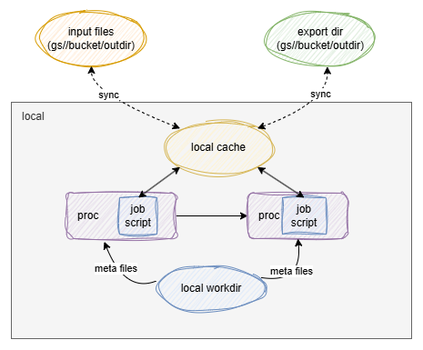

# pipen-gcs

A plugin for [pipen][1] to handle files in Google Cloud Storage.

> [!NOTE]
> Since pipen v0.16.0, it introduced cloud support natively. See [here](https://pwwang.github.io/pipen/cloud/) for more information.
> However, when the pipeline working directory is a local path, but the input/output files are in the cloud, we need to handle the cloud files ourselves and in the job script.
> To avoid that, we can use this plugin to download the input files and upload the output files automatically.

> [!NOTE]
> Also note that this plugin does not synchronize the meta files to the cloud storage; they are already handled by pipen when needed. This plugin only handles the input/output files when the working directory is a local path. When the pipeline output directory is a cloud path, the output files will be uploaded to the cloud storage automatically.



## Installation

```bash
pip install -U pipen-gcs
```

## Usage

```python
from pipen import Proc, Pipen
import pipen_gcs  # Import and enable the plugin

class MyProc(Proc):
    input = "infile:file"
    input_data = ["gs://bucket/path/to/file"]
    output = "outfile:file:{{in.infile.name}}.out"
    # We can deal with the files as if they are local
    script = "cat {{in.infile}} > {{out.outfile}}"

class MyPipen(Pipen):
    starts = MyProc
    # input files/directories will be downloaded to /tmp
    # output files/directories will be generated in /tmp and then uploaded
    #   to the cloud storage
    plugin_opts = {"gcs_cache": "/tmp"}

if __name__ == "__main__":
    # The working directory is a local path
    # The output directory can be a local path, but if it is a cloud path,
    #   the output files will be uploaded to the cloud storage automatically
    MyPipen(workdir="./.pipen", outdir="./myoutput").run()
```

> [!NOTE]
> When checking the meta information of the jobs, for example, whether a job is cached, the plugin will make `pipen` to use the cloud files.


## Configuration

- `gcs_cache`: The directory to save the cloud storage files.

[1]: https://github.com/pwwang/pipen
